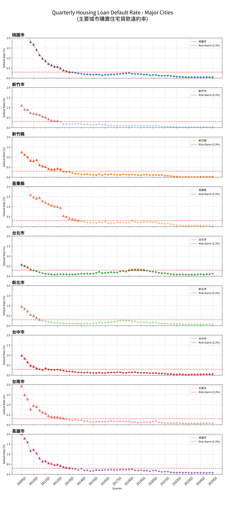

# TaiwanHouse
TaiwanHouse 為台灣房市資料視覺化與監控專案，目前聚焦兩項指標：
1. 本季購置住宅貸款違約率
2. 全台建物買賣移轉棟數

## 授權
本專案採用 MIT 授權條款，請參閱 `LICENSE`。

## 快速開始
1. 安裝依賴：
   ```bash
   pip install pandas matplotlib requests selenium webdriver-manager pytz
   ```
2. 更新違約率圖表：
   ```bash
   python scripts/fetch_and_plot.py
   ```
3. 更新全台移轉棟數監控：
   ```bash
   python scripts/monitor_transfer_count.py
   ```

## 資料視覺化

### 資料視覺化- 本季購置住宅貸款違約率
使用腳本：`scripts/fetch_and_plot.py`

輸出結果：
* **資料檔案：** `data/csv/housing_loan_default_rate.csv`
* **圖表：** `data/svg/major_cities_default_rate.svg`

資料說明：
* 資料來源：內政部不動產資訊平台整合項目下載區 (E3030)。
* 資料範圍：依官方提供，最早至民國 98 年第 1 季 (098Q1)。
* 圖表內容：主要城市（臺北市、新北市、桃園市、新竹市、新竹縣、苗栗縣、臺中市、臺南市、高雄市）之違約率趨勢。

README 自動更新：`scripts/fetch_and_plot.py` 會更新本節的 `Update time`。

Update time: 2026-02-16 15:26:19 CST



### 資料視覺化- 全台建物買賣移轉棟數
使用腳本：`scripts/monitor_transfer_count.py`

輸出結果：
* **資料檔案：** `data/csv/taiwan_building_transfer_count.csv`
* **圖表：** `data/svg/taiwan_building_transfer_count.svg`
* **監控摘要：** `data/reports/taiwan_building_transfer_monitor.md`

監控說明：
* 資料來源：內政部不動產資訊平台整合項目下載區 (E3030)。
* 資料處理：優先採用全台列，若無全台列則彙總各地區。
* 監控內容：最新一期、前一期、去年同期差異。

README 自動更新：`scripts/monitor_transfer_count.py` 會更新本節的 `Update time`。

Update time: 2026-02-16 19:20:40 CST


## 自動化更新
GitHub Actions 工作流程 `/.github/workflows/monthly_update.yml` 每月會自動執行兩支腳本，同步更新兩項資料視覺化與相關輸出。
