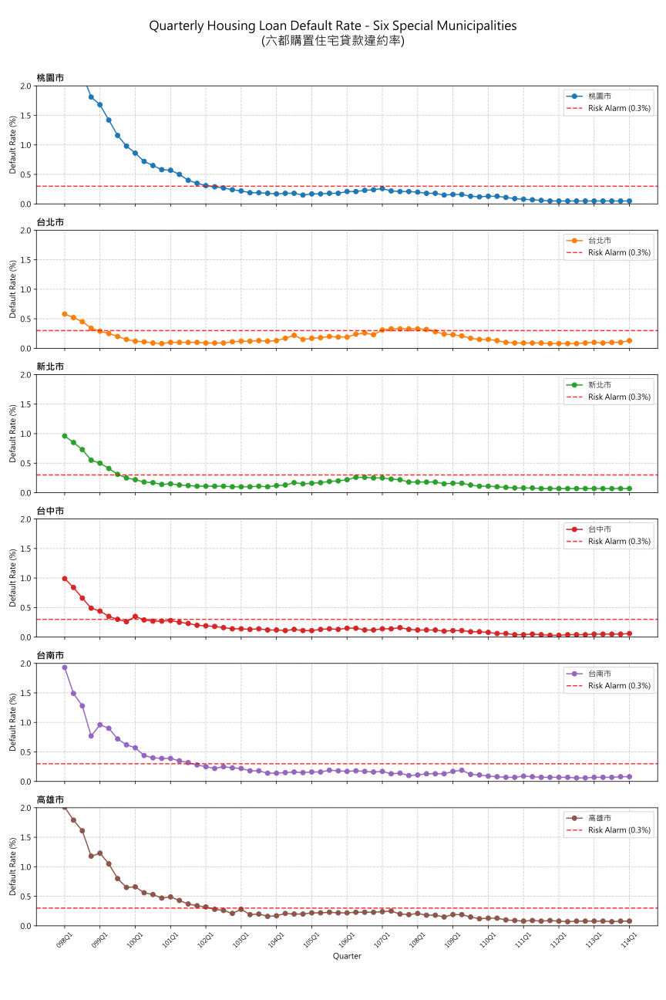

# TaiwanHouse
TaiwanHouse 的工作空間

## 授權

本專案採用 MIT 授權條款 - 詳細內容請參閱 [LICENSE](LICENSE) 檔案。

## 資料視覺化

本專案包含一個 Python 腳本，用於獲取並視覺化六都的 **本季購置住宅貸款違約率**。

### 使用方法

1.  **安裝依賴項目：**
    ```bash
    pip install requests pandas matplotlib
    ```

2.  **執行腳本：**
    ```bash
    python scripts/fetch_and_plot.py
    ```

### 輸出結果：
*   **資料檔案：** `data/csv/housing_loan_default_rate.csv`（來自內政部不動產資訊平台之真實數據）
*   **圖表：** `data/svg/six_cities_default_rate.svg`

> **注意：** 根據內政部官方提供的整合項目下載區 (E3030)，「購置住宅貸款違約率」的 CSV 資料最早自 **民國 98 年第 1 季 (098Q1)** 開始提供。此時段正值金融海嘯時期，全國違約率高點約為 1.39%。



### 圖表說明
此 SVG 圖表展示了六個直轄市（臺北市、新北市、桃園市、臺中市、臺南市、高雄市）的購置住宅貸款違約率趨勢：
*   **X 軸 (橫軸)：** 代表季別（例如 108Q1 代表民國 108 年第 1 季）。
*   **Y 軸 (縱軸)：** 代表違約率百分比 (%)。
*   **資料點：** 每個圓點代表該季度的數據觀測值。
*   **折線：** 不同的顏色線條區分不同的城市，方便觀察各都市間的趨勢差異與比較。

此圖表由 `scripts/fetch_and_plot.py` 自動生成，利用 `matplotlib` 進行繪製並匯出為向量圖格式 (SVG)，確保在任何縮放比例下都能保持清晰。

### 腳本詳細說明
腳本 `scripts/fetch_and_plot.py` 會執行以下操作：
*   從 `pip.moi.gov.tw` 獲取下載頁面。
*   定位違約率資料的 CSV 下載連結。
*   下載 CSV（若伺服器拒絕請求，則自動生成範例資料作為備案）。
*   過濾出六都（臺北市、新北市、桃園市、臺中市、臺南市、高雄市）的資料。
*   生成時間序列圖並儲存為 SVG 格式。
