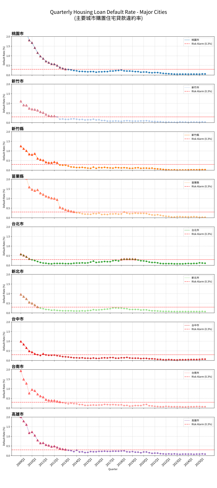
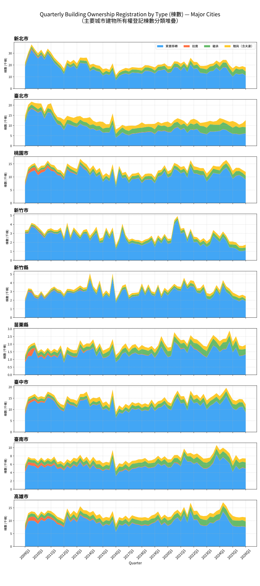
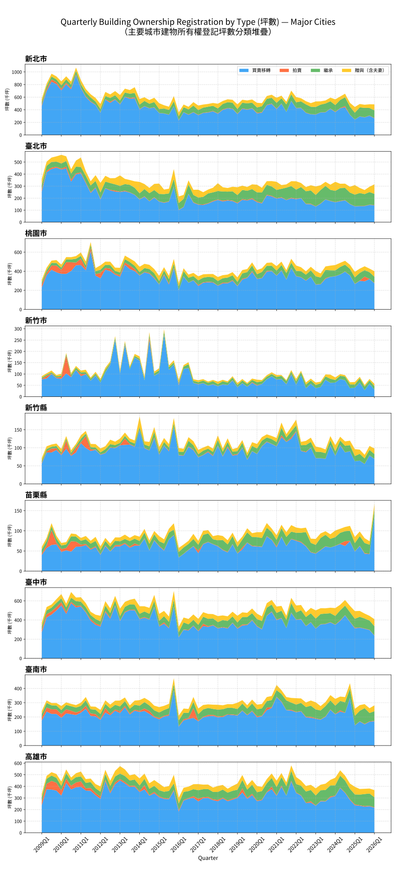

# TaiwanHouse
TaiwanHouse 為台灣房市資料視覺化與監控專案，目前聚焦兩項指標：
1. 本季購置住宅貸款違約率
2. 主要城市建物所有權登記堆疊趨勢（買賣移轉、繼承、贈與、拍賣）

## 授權
本專案採用 MIT 授權條款，請參閱 `LICENSE`。

## 快速開始
1. 安裝依賴：
   ```bash
   pip install pandas matplotlib requests selenium webdriver-manager pytz
   ```
2. 更新違約率圖表：
   ```bash
   python scripts/fetch_and_plot.py
   ```
3. 更新主要城市建物登記堆疊趨勢：
   ```bash
   python scripts/fetch_transaction_trend.py
   ```

## 資料視覺化

### 資料視覺化- 本季購置住宅貸款違約率
使用腳本：`scripts/fetch_and_plot.py`

輸出結果：
* **資料檔案：** `data/csv/housing_loan_default_rate.csv`
* **圖表：** `data/svg/major_cities_default_rate.svg`

資料說明：
* 資料來源：內政部不動產資訊平台整合項目下載區 (E3030)。
* 資料範圍：依官方提供，最早至民國 98 年第 1 季 (098Q1)。
* 圖表內容：主要城市（臺北市、新北市、桃園市、新竹市、新竹縣、苗栗縣、臺中市、臺南市、高雄市）之違約率趨勢。

README 自動更新：`scripts/fetch_and_plot.py` 會更新本節的 `Update time`。

Update time: 2026-05-23 22:03:33 CST



### 資料視覺化- 建物所有權登記堆疊趨勢 (棟數)
使用腳本：`scripts/fetch_transaction_trend.py`

輸出結果：
* **資料檔案：** `data/csv/building_ownership_trend.csv`
* **圖表：** `data/svg/building_ownership_trend.svg`

資料說明：
* 資料來源：內政部統計處土地統計資料庫 (`statis.moi.gov.tw`，`funid=c0510302`)，直接 HTTP 下載。
* 資料範圍：民國 98 年第 1 季（2009 Q1）起，與違約率圖表 X 軸對齊。
* 圖表內容：主要城市（臺北市、新北市、桃園市、新竹市、新竹縣、苗栗縣、臺中市、臺南市、高雄市）各季建物所有權登記棟數，依買賣移轉、拍賣、繼承、贈與（含夫妻贈與）四類堆疊呈現。

README 自動更新：`scripts/fetch_transaction_trend.py` 會更新本節的 `Update time`。


Update time: 2026-05-24 12:50:13 CST



### 資料視覺化- 建物所有權登記堆疊趨勢 (面積/坪數)
使用腳本：`scripts/fetch_transaction_trend.py`

輸出結果：
* **資料檔案：** `data/csv/building_ownership_trend.csv`
* **圖表：** `data/svg/building_ownership_trend_area.svg`

資料說明：
* 資料來源：內政部統計處土地統計資料庫 (`statis.moi.gov.tw`)，單位已轉換為「坪」。
* 圖表內容：主要城市各季建物所有權登記面積（坪數），依買賣移轉、拍賣、繼承、贈與（含夫妻贈與）四類堆疊呈現。反映市場交易之物理規模。

README 自動更新：`scripts/fetch_transaction_trend.py` 會更新本節的 `Update time`。

Update time: 2026-05-24 12:50:13 CST



## 自動化更新
GitHub Actions 工作流程 `/.github/workflows/monthly_update.yml` 每月會自動執行兩支腳本，同步更新兩項資料視覺化與相關輸出。
